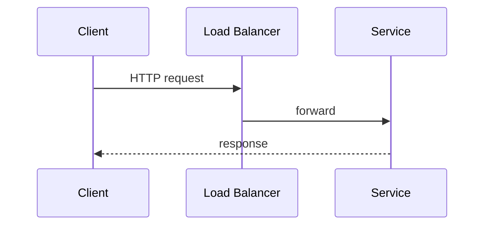

Drop any `.md` file into `src/content/docs/` and it becomes a page.
Folders under `guides/` show up in the sidebar automatically.

## Mermaid diagrams

Use a fenced `mermaid` block:

```mermaid
flowchart LR
  A[Write .md] --> B[Astro build]
  B --> C[Pele renders SVG]
  C --> D[Static site]
```

```mermaid
sequenceDiagram
  participant C as Client
  participant LB as Load Balancer
  participant S as Service
  C->>LB: HTTP request
  LB->>S: forward
  S-->>C: response
```
